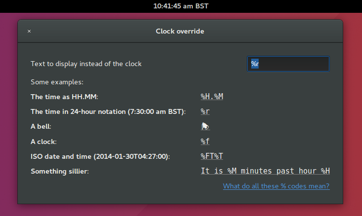

# gnome-shell-clock-override
Override the Gnome Shell clock with a new time format or text of your choice. Works with new versions of Shell such as 3.18. 

**If you're looking to _use_ this extension, don't get it from here; this is for developers. To add this extension to your desktop, click [here](https://extensions.gnome.org/extension/1206/clock-override/) to get it from [extensions.gnome.org](https://extensions.gnome.org/extension/1206/clock-override/).**

Gnome Shell doesn't permit many changes to the format of its clock; in particular, it's not possible to remove it completely or to add text around it. That's what this extension is for: you can set the clock's "format string" to change how the Gnome Shell clock is displayed (do you want it as HH:MM? HH.MM? "10:37:21 am"?), including setting it to just a fixed string (for example, a bell) so you have somewhere to click to see notifications and calendar but no clock on-screen.

For techies, we use the [`strftime` codes](http://strftime.org/) to specify actual times in your clock string, with a `%f` addition to mean "a little Unicode clock character" (thanks to [dsboger](https://github.com/stuartlangridge/gnome-shell-clock-override/commit/5941974a39d3dfa4f7adb227bdbe3bc50118bbc9) for that!)

Note that we still try to honour Gnome Shell's clock settings. So if you expect your clock to show seconds (or to update once a second, rather than once a minute) then you'll need to have turned on "show seconds" in Gnome Tweak Tool (under Top Bar) (or [the terminal way](https://askubuntu.com/questions/39412/how-to-show-seconds-on-the-clock-in-gnome-3)).